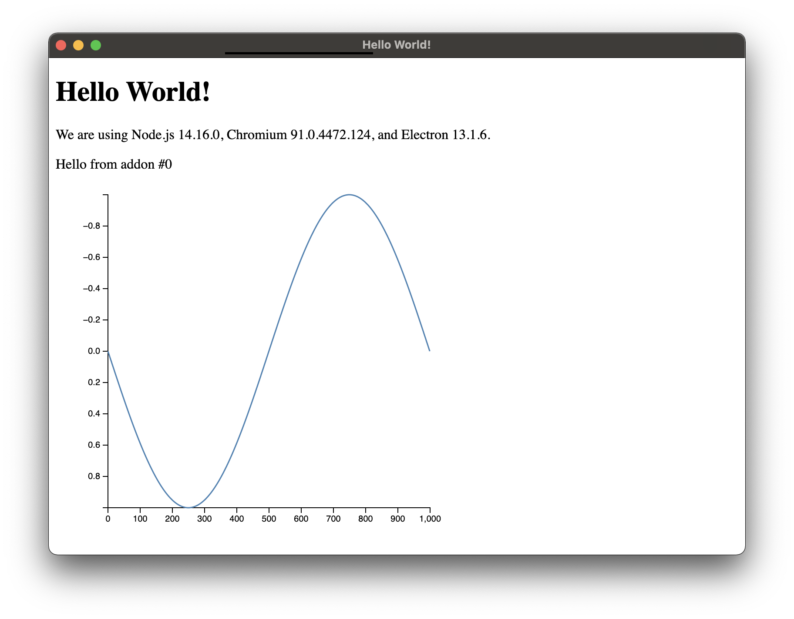

# Read a numpy array into an electron app via embedded python

## Prerequisites

- [nvm](https://github.com/creationix/nvm)
- [yarn](https://yarnpkg.com/en/docs/install)
- [python3](https://www.python.org/downloads/)
- [numpy](https://www.numpy.org/)
- [cmake](https://cmake.org/)
- C/C++ compiler

## Building and running

1. `nvm use latest` - This was done w v16.4.2
2. `yarn install`
3. `yarn start`

## What to expect

The first time you run, you'll see an electron window pop up, but in the
terminal you'll find this error message:

```
FileNotFoundError: [Errno 2] No such file or directory: 'data.f64'
```

Create that file! Here's an example in python w numpy:

```python
from numpy import *
a=sin(linspace(0,2*pi,1000))
with open("data.f64","wb") as f:
    f.write(a)
```

The next time you run, check the developer console (open dev tools from the menu
in the electron window).

You'll see this (somewhere) in the dev tools console:

```
Float64Array(1000)
```

and this in the window:



Pretty sweet!

## How does it work

The electron app loads calls a function defined as an [N-API][] module. That happens
in `src/preload.js`.

To build the module, we use [cmake][] to generate a shared library,
`iffy.node`. When `yarn install` is called, a tool called [cmake-js][] is run.
That tool just locates the node include directories and launches cmake with
the appropriate flags. To import `iffy.node`, we just `require` it like any other
(local) module.

Inside `iffy.node`, there's a function that defines the contents of the module
and returns a node object:

```c
napi_value create_addon(napi_env env);
```

The module exposes a function, `onePythonCall`. This C function:

- extracts a filename from the node arguments
- starts the python interpreter
- imports numpy
- calls `numpy.fromfile` using the filename.
- copies data from the returned numpy array into a node `ArrayBuffer`

[N-API]: https://github.com/nodejs/node/blob/master/doc/api/n-api.md]
[cmake-js]: https://github.com/cmake-js/cmake-js

## Notes

- Would be nice to explore returning dimensional data. Currently just calling `numpy.fromfile()` which always returns 1-d.
- There's a problem calling the python invocation more than once.

# Related Work

- [stdlib-js](https://github.com/stdlib-js/ndarray-base-napi-typedarray-type-to-dtype)
